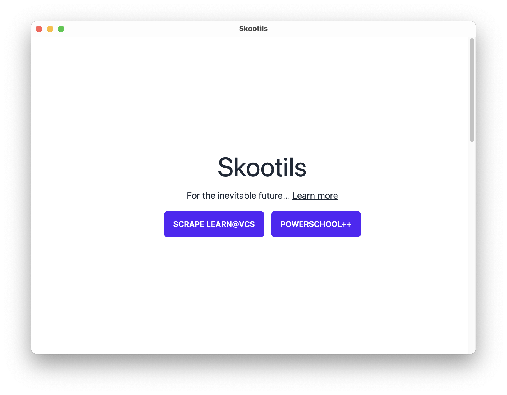
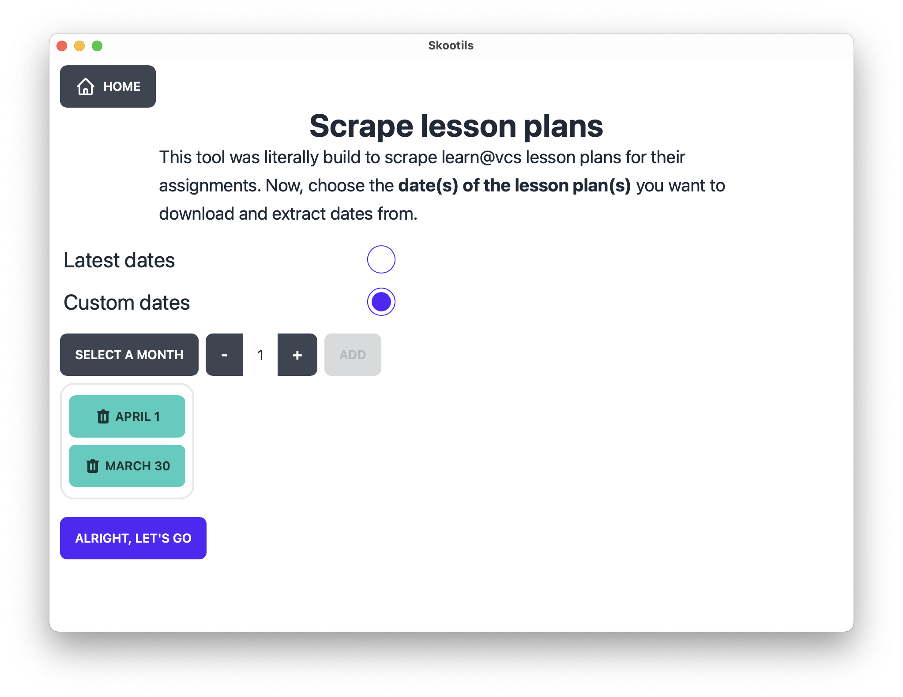
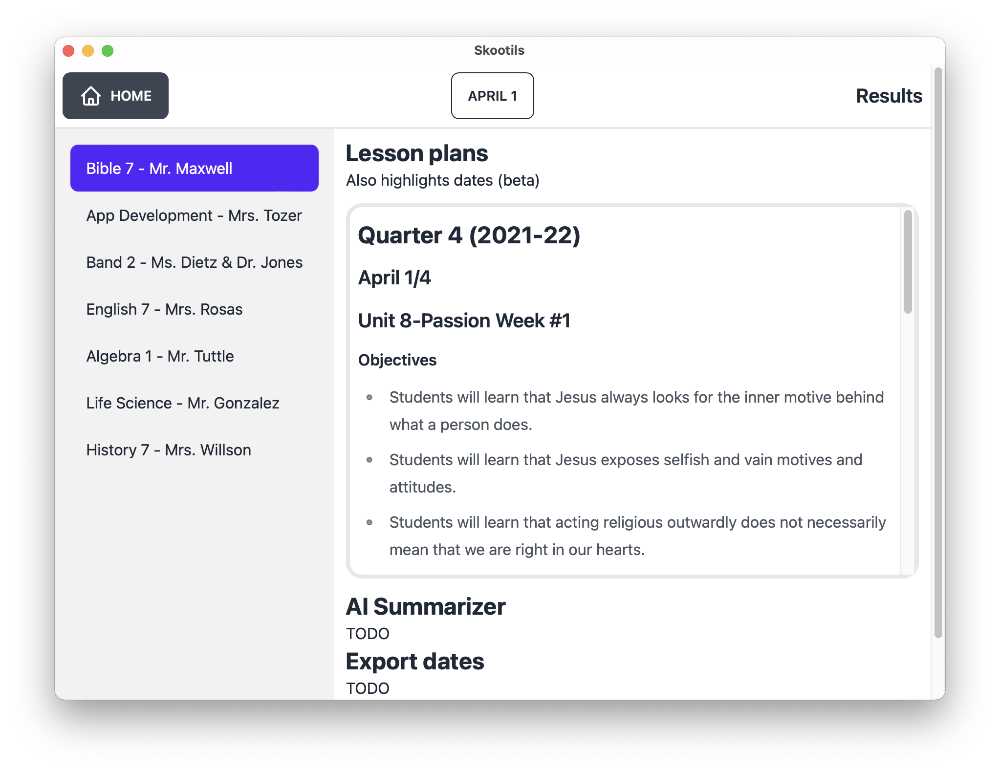
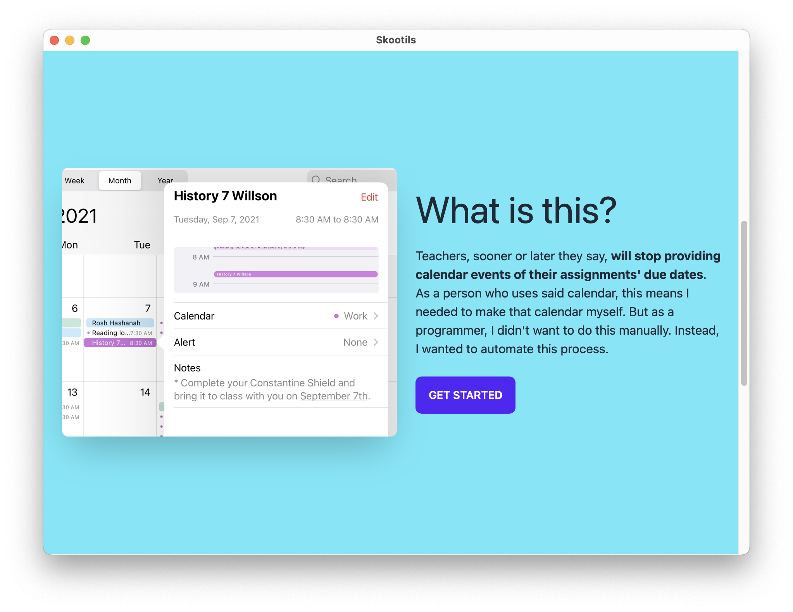
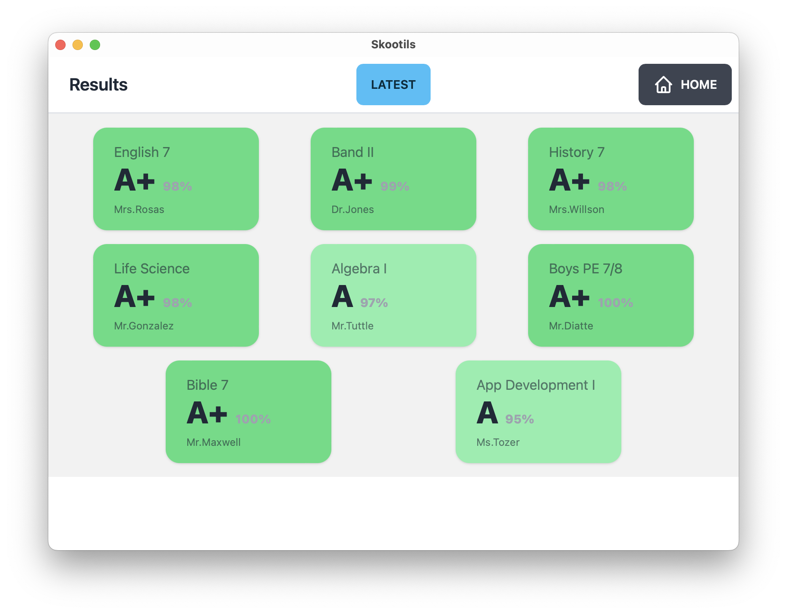
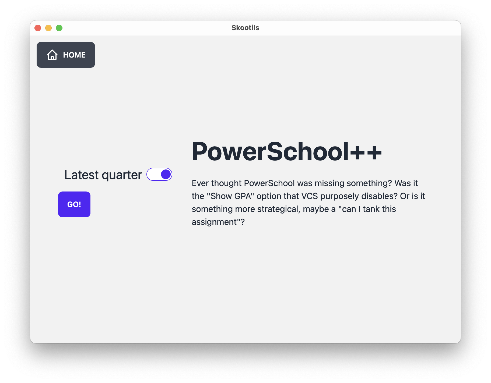

# Skootils

> Utilities for School

Work in progress. Fully packaged binaries and landing page coming soon!

Priorities (help is appreciated):
 - [PowerSchool grade timeline](https://github.com/ThatXliner/skootils/issues/29)
 - [learn@vcs date regex](https://github.com/ThatXliner/skootils/issues/28)

Click to view demo images

## License

Copyright © 2021, Bryan Hu

This project is licensed under the [GNU GPL v3+](./COPYING) unless specified otherwise.

In short, this means you can do anything with it (distribute, modify, sell) but if you were to publish your changes, you must make the source code and build instructions readily available.

If you are a company using this project and want an exception, email me at [bryan.hu.2020@gmail.com](mailto:bryan.hu.2020@gmail.com) and we can discuss.
